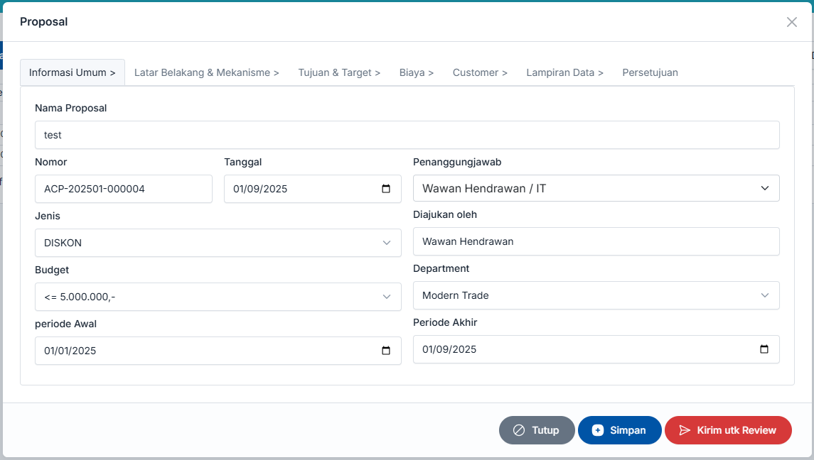

# Proposal

## Pendahuluan

## Alur Kerja

Alur kerja proposal pada applikasi dibagi menjadi 4 bagian yaitu :&#x20;

1. Pembuatan Proposal
2. Review & Persetujuan Proposal
3. Monitoring / Pelaporan Progress
4. Pertanggung Jawaban

Pada versi sekarang ini, yang terimplementasi di sistem baru 2 tahap yaitu, Pembuatan Proposal dan Review & Persetujuan Proposal

Alur Proses Proposal :&#x20;

1. Membuat proposal dalam bentuk draft, masih bisa diedit oleh user pembuat ( penyetuju harus sudah ditentukan dengan benar, karena akan digunakan dalam alur review dan persetujuan )
2. Submit untuk Review, akan muncul di Review Superior1, selanjutnya superior1 akan Review, apabila diperlukan perubahan data, user masih bisa melakan perubahan, tetepi daftar user penyetuju sudah tidak bisa diubah lagi.&#x20;
3. Superior1 klik selesai Review dianggap juga sebagai bentuk persetujuan, akan masuk ke Review Superior2 dan seterusnya, semua proses tersebut akan mengirimkan email format email Review.
4. Setelah Reviewer Finance (Reviewer5) selesai Review akan kirim email format approval dilengkapi dengan link token.&#x20;

### User Akses

Applikasi Proposal bisa digunakan oleh seluruh user yang terdaftar pada applikasi SiskA dan memiliki Role Proposal.

Applikasi ini diperuntukan sebagai berikut :&#x20;

* ASPS / ASPM / RSM
* Marketing Team
* Office Staff yang membuat Proposal

## Membuat Proposal

Sebelum anda membuat proposal pada applikasi pastikan anda memiliki cukup informasi untuk di input kedalam proposal.

1.  Buka menu Proposal > Proposal , akan tampil seperti gambar dibawah ini

    <figure><figcaption>
Daftar Proposal yang masih dalam pembuatan (DRAFT )
</figcaption></figure>
2. Di dalam daftar proposal di atas, sebelah kanan ada filter, untuk menampilkan data berdasarkan status, yg berisi pilihan yaitu
   1. **DRAFT**, data yang tampil adalah yang belum di kirim untuk REVIEW
   2. **WAITING FOR APPROVAL**, data yang tampil adalah data yg dalam proses REVIEW dan PERSETUJUAN/APPROVAL
   3. **APPROVED**, data yang tampil adalah dataa yang sudah di APPROVE dan dalam proses eksekusi proposa**l**
   4. **COMPLETE**, data yang tampil adalah data yang sudah lengkap termasuk pertangungjawaban
3. Untuk membuat Proposal Baru, klik tombol **Buat baru**,
4. Akan tampil form isian Proposal, dan berikut penjelasan petunjuk pengisiannya
   1.  Pada Tab Informasi Umum

       * Nama Proposal, diisi dengan Nama Proposal
       * Nomor, akan otomatis digenerate
       * Tanggal, pilihan tanggal proposal ( default akan mengikuti tanggal hari ini )
       * Jenis, pilih dari daftar pilihan yang ada sesuai dengan jenis proposalnya ( Pastikan jangan salah pilih )
       * Budget, pilih total opsi pilihan total budget yang akan digunakan ( pilihan antara kurang dari 5 juta dan lebih dari 5 juta, akan mempengaruhi penandatangan )
       * Penangung Jawab, pilih dari daftar pilihan karyawan anggana sebagai penanggung jawab proposal ini. Penanggung jawab nantinya akan bertanggung jawab dan melakukan updating progress proposal ini
       * Diajukan oleh, default terisi oleh user yang sedang membuat
       * Departement, pilih dari daftar pilihan departement. Pilihan departemen ini juga akan terkait dengan daftar budget biaya yang dibuat apabila ada.
       * Periode awal dan periode akhir, pilih tanggal kapan proposal ini akan berjalan
       * Selanjutnya pindah ke tab berikutnya yaitu Latar belakang dan Mekanisme

       <figure><figcaption></figcaption></figure>
   2.  Pada tab Latar Belakang dan Mekanisme

       Isikan **Latar Belakang** dan **Mekanisme** dari proposal ini. Dan setelah di lengkapi pindah ke tab Tujuan dan Target

       <figure><figcaption></figcaption></figure>
   3.  Pada tab Tujuan & Target

       1. Pada tab Tujuan Dan Target, isikan Tujuan dari Proposal ini, dan untuk target masukan average before dan target amountnya.
       2. Untuk Target akan ada beberapa pilihan target

       <figure><figcaption></figcaption></figure>
   4.  Pada tab Biaya

       1. fsafa

       <figure><figcaption></figcaption></figure>
   5.  Pada tab Customer

       1. Pilih customer yang terkait dengan proposal ini

       <figure><figcaption></figcaption></figure>
   6.  Pada tab Lampiran Data

       1. Masukan data pendukung yang terkait dengan proposal ini

       <figure><figcaption></figcaption></figure>
   7.  Pada tab Persetujuan,

       1. Pilih user - user yang

       <figure><figcaption></figcaption></figure>
5. Apabila ada proposal dimana di nama proposal-nya tampil kosong, berarti proposal tersebut masih bisa anda gunakan, tinggal klik tombol Edit, untuk kemudian dilengkapi lagi dan di Simpan.

## Review & Persetujuan Proposal

Proposal yang telah dibuat oleh pembuat akan melalui tahapan Review dan Persetujuan untuk bisa dijalankan  / dieksekusi. Review Proposal dilakukan oleh atasan pembuat proposal 1 dan 2 kemudian Brand Manager, Marketing Manager dan Audit, Review oleh team tersebut juga bisa di sebut sebagai persetujuan. Setelah Review melewati Audit selanjutnya akan masuk pada persetujuan oleh COO, untuk proposal dibawah 5 juta dan CFO serta CEO untuk proposal di atas 5 juta.

Adapun cara melakukan Review adalah sebagai berikut :&#x20;

* Saat pertama kali Proposal di klik Submit untuk persetujuan Akan Terkirim notifikasi Email ke Atasan 1 untuk melakukan Review, atasan 1 yang menerima email bisa langsung klik pada link email notifikasi untuk melakukan Review
* Cara lainnya adalah Atasan 1 masuk ke applikasi SiskA, kemudian Pilih Menu Review, apabila ada proposal yang menunggu direview akan tampil di dalam daftar untuk di Review, selanjutnya Klik tombol Review
* Setelah tombol Review dibuka, akan tampil informasi tentang proposal yang akan di review, Reviewer bisa melihat informasi rinci proposal. Dan dibawahnya ada chatbox yang berfungsi untuk reviewer bisa memberikan catatan - catatan dan berinteraksi dengan user yang input proposal ataupun penanggung jawab terkait proposal tersebut.
* Ketikan pada chat box apabila ada pertanyaan atau apapun terkait proposal kepada yang input proposal ataupun penanggung jawab ( bisa juga dilengkapi dengan lampiran ),
* Dan sebaliknya yg input proposalpun ataupun penanggung jawabnya bisa mengirimkan chat juga.
* Apabila dianggap proposal sudah OK, maka di kanan atas dari Form Review ada tombol "Review OK", klik pada tombol tersebut,
* Untuk selanjutnya proses review akan diteruskan ke Approval 2, begitu seterusnya
* Setelah Approval 2 klik Review OK, proses Review akan diteruskan ke Marketing Brand
* Setelah Marketing Brand klik Review OK, proses Review akan diteruskan ke Marketing Manager
* Setelah Marketing Manager klik Review OK, proses Review akan diteruskan ke Finance
* Setelah Finance klik Review OK, proses Review akan diteruskan ke Audit
* Setelah Audit klik Review OK, proses Review akan diteruskan ke COO,
* Setelah COO klik Review OK, proses Review akan diteruskan ke CFO,
* Setelah CFO klik Review OK, proses Review akan diteruskan ke CEO,
* Khusus untuk COO, CFO dan CEO, Review bisa dilakukan melalui applikasi SiskA dengan login ke Applikasi, dan bisa juga klik link yang ada di email untuk kemudian masuk ke proses Approval dengan memasukan token tanpa harus login ke Applikasi.
* Setelah semua proses Review / Approval selasai, selanjutnya proposal akan masuk ke tahap eksekusi dan monitoring, yang akan tampil di menu Monitoring.

### Approval via Menu

### Approval via Link email

## Monitoring Proposal

## Pertanggungjawaban

